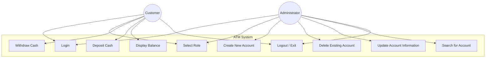
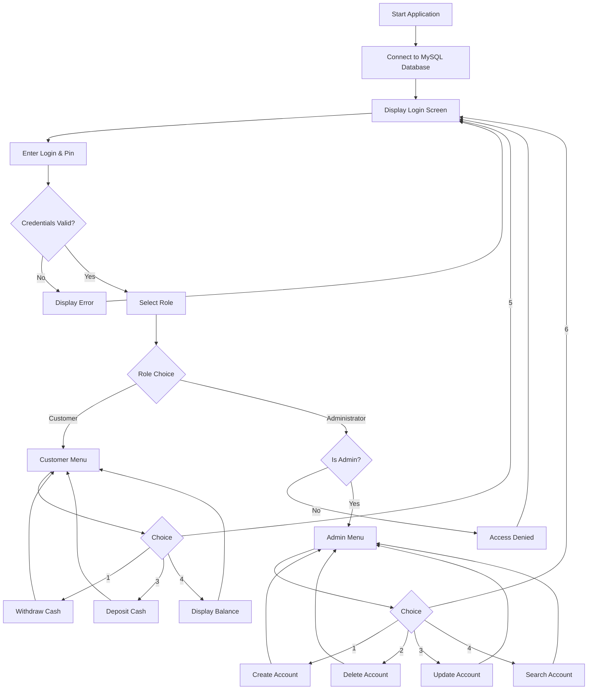
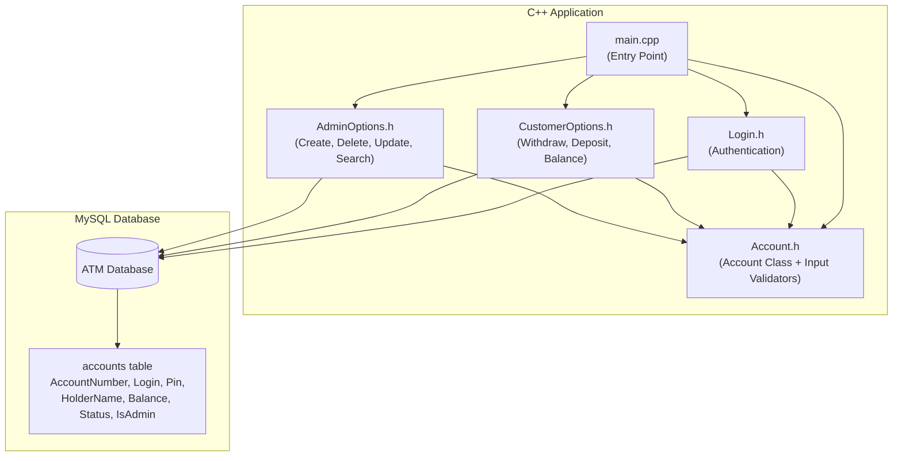
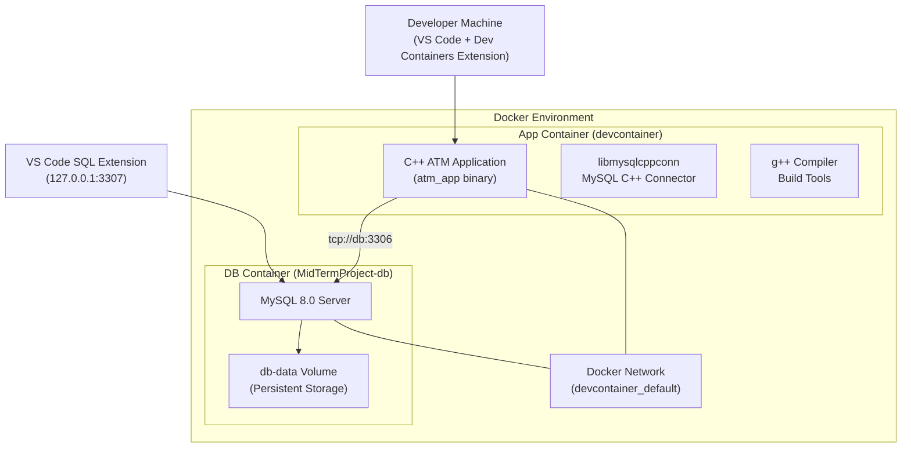
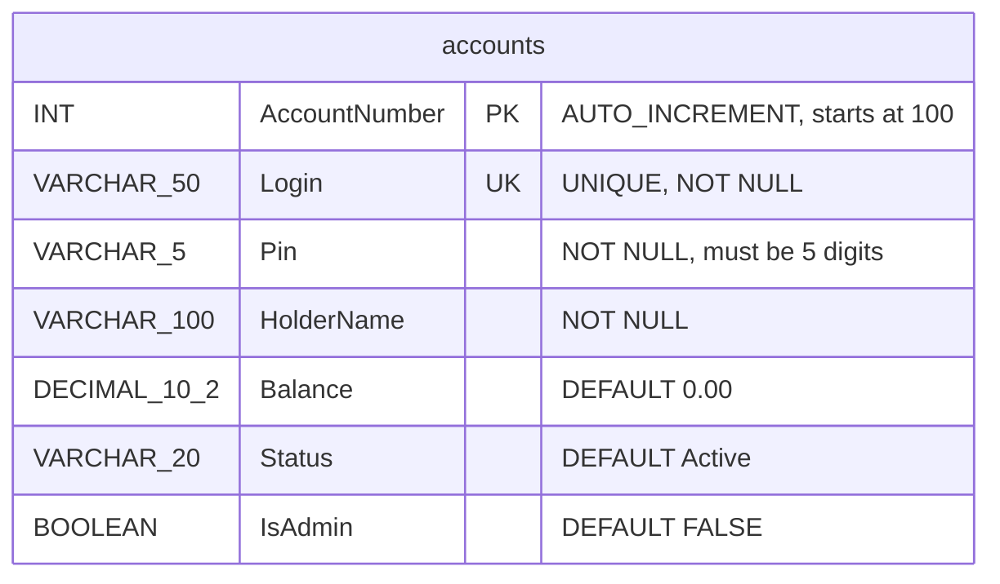

# ATM System Diagrams

## 1. Use Case Diagram

### Actors
- **Customer** — A user with a bank account who can perform transactions
- **Administrator** — A privileged user who manages customer accounts

### Use Case Descriptions

| Use Case | Actor(s) | Description |
|----------|----------|-------------|
| Login | Customer, Admin | User enters login and 5-digit pin. System verifies credentials against the database. |
| Select Role | Customer, Admin | After login, user selects Customer or Administrator role. Access is validated. |
| Withdraw Cash | Customer | Customer enters amount to withdraw. System validates (positive, sufficient funds), updates balance in DB, displays receipt. |
| Deposit Cash | Customer | Customer enters amount to deposit. System validates (positive), updates balance in DB, displays receipt. |
| Display Balance | Customer | System displays account number, current date, and balance. |
| Create New Account | Admin | Admin enters login, pin, name, balance, status. System validates pin (5 digits), checks for duplicate login, creates account. |
| Delete Existing Account | Admin | Admin enters account number. System shows holder name, asks for re-confirmation, deletes account. |
| Update Account Information | Admin | Admin enters account number. System shows current info. Admin can update holder, balance, status, login, or pin. |
| Search for Account | Admin | Admin enters account number. System displays full account details. |
| Logout / Exit | Customer, Admin | User exits their menu and returns to the login screen. |

---

## 2. Application Flow Diagram

---

## 3. Component Diagram

### Component Responsibilities

| Component | File | Responsibility |
|-----------|------|----------------|
| Entry Point | `main.cpp` | DB connection, login loop, role selection, menu routing |
| Account Model | `Account.h` | Data encapsulation (private members, getters/setters), input validation helpers |
| Authentication | `Login.h` | Prepared statement login query, populates Account object |
| Customer Options | `CustomerOptions.h` | Withdraw, deposit, display balance with DB updates |
| Admin Options | `AdminOptions.h` | CRUD operations on customer accounts |
| Database Schema | `schema.sql` | Table definition and seed data |

---

## 4. Deployment Diagram

### Deployment Details

| Component | Container | Port | Notes |
|-----------|-----------|------|-------|
| C++ App | `devcontainer-app` | N/A | Runs inside dev container, connects to DB via service name `db` |
| MySQL 8.0 | `MidTermProject-db` | 3306 (internal), 3307 (host) | Persistent data via `db-data` Docker volume |
| Docker Network | `devcontainer_default` | — | Enables container-to-container communication via DNS |

---

## 5. Database Schema Diagram

